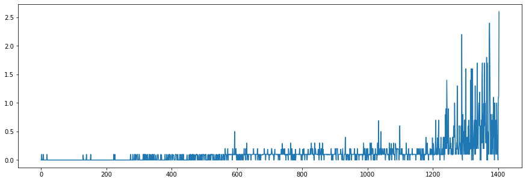

# Adversarial Agents with Reinforcement Learning

## Section 1: Getting Started
### Intro


### Dependencies
```
torch==1.0.0
numpy==1.19.5
unityagents==0.4.0
```
### Relevant Folders
- `assets` contains the trained weight checkpoints organised in folders per algorithm
- `figures` contains the figures later shown in this document.
- `src` contains the implementation of the models

### Relevant Files
- `DDPG_Tennis.ipynb` Is the notebook used to train the DDPG model.
- `MADDPG_Tennis.ipynb` Is the notebook used to train the DDPG model.
- `pretrained_demo.ipynb` Is the notebook used to load the pretrained models and execute them.

## Section 2: Download the Unity Environment
For this project, you will not need to install Unity - this is because we have already built the environment for you, and you can download it from one of the links below. You need only select the environment that matches your operating system:

- Linux: click [here](https://s3-us-west-1.amazonaws.com/udacity-drlnd/P3/Tennis/Tennis_Linux.zip)
- Mac OSX: click [here](https://s3-us-west-1.amazonaws.com/udacity-drlnd/P3/Tennis/Tennis.app.zip)
- Windows (32-bit): click [here](https://s3-us-west-1.amazonaws.com/udacity-drlnd/P3/Tennis/Tennis_Windows_x86.zip)
- Windows (64-bit): click [here](https://s3-us-west-1.amazonaws.com/udacity-drlnd/P3/Tennis/Tennis_Windows_x86_64.zip)

(For Windows users) Check out this [link](https://support.microsoft.com/en-us/help/827218/how-to-determine-whether-a-computer-is-running-a-32-bit-version-or-64) if you need help with determining if your computer is running a 32-bit version or 64-bit version of the Windows operating system.


**NB To use the code as is, please import the environments in the unity folder**


## Section 3: Implemented Algorithms
### Deep Deterministic Policy Gradient
This used implementation of the PPO algorithm uses the following modules:
- `network.py` implements `DDPGPolicy` network and its components `Actor` and `Critic`.
- `agent.py` implements `DDPGAgent` class that encompasses the behaviour of the agent (performing an action on the environment, running a test episode on the environment).
- `trainer.py` Implements the `DDPGTrainer` containing all the functionality for training an agent through the DDPG algorithm. It builds a training buffer of execution. The buffer is sampled to train the agent policy for multiple epochs. The trained policy belongs to a clone of the trained agent. The agent is improved by applying soft update from the cloned agent.
- `buffer_replay.py` implements `ReplayBuffer` and `PrioritizedReplayBuffer` who collect the data of coming from the training rollouts. The main difference is how the training samples are collected from the buffers. In the first case it's just a FIFO queue uniformly sampled. In the second a priority value is assigned on each sample. The samples are finally collected based on that priority value. The priority value is updated after each sample.
-
### Multi-Agent Deep Deterministic Policy Gradient
This used implementation of the PPO algorithm uses the following modules:
- `network.py` implements `MADDPGPolicy` network and its components `Actor` and `Critic`.
- `agent.py` implements `MADDPGAgent` class that encompasses the behaviour of the agent (performing an action on the environment, running a test episode on the environment).
- `trainer.py` Implements the `MADDPGTrainer` containing all the functionality for training an agent through the DDPG algorithm. It builds a training buffer of execution. The buffer is sampled to train the agent policy for multiple epochs. The trained policy belongs to a clone of the trained agent. The agent is improved by applying soft update from the cloned agent.
- `buffer_replay.py` implements `ReplayBuffer` who collect the data of coming from the training rollouts. The main difference is how the training samples are collected from the buffers.

## Section 4: Results

Both the approaches reached convergence successfully. The MultiAgent extension provided some benefit in terms of learning stability (there was no collapse in scores mid-learning) and speed of learning (number of episodes required to reach the target).

In the experiments we set a requirements for termination that is higher than the one requested by the environment definition.
We terminate the learning phase at the momement we reach a 100 episode average score of `0.6`.

Keep in mind that, according to suggestions provided by the assignment, the score should be measured based on the cumulative max score of the 2 agents. We compute the score accordingly.

#### DDPG

DDPG reaches the training target (`0.6`) in more than 2500 (almost 3000) episodes but it would reach the `0.5` target much earlier than that. The training score collapsed after 2000 episodes and started recovering at episode 2500. This clearly has to do with the stationarity of the environment and an overconfident policy.

Overall, the agent reached the target but vwey slowly and had a collapse once positive results were reached.


#### MA-DDPG

The multi-agent extension provided several benefits on the agent learning. The `0.6` target was met in only 1400 episodes without having any collapse in the training (yet).

As can be observed, the policy learned are quite similar during execution. It reaches an equilibrium in the rackets movements on the central area of the tennis field.




## Section 5: Future improvements

#### Useless Movements

I find interesting how the agent behaves when the ball is on the other side. In both cases, the racket goes close to the net to then return back in the central position when the ball comes to their side. These seem like unnecessary movements.
To fix this, one could reduce the value of a state action of a factor dependant to the magnitude of the action. This should discourage movements that don't lead to improve the actual reward.

#### Convergence to repetition

In this specific environment the two agents converge (In both cases) to a situation in which the two agents just try to pass each other the ball using always the same movements.

I think that introducing some competitivity in the reward could improve the behaviour. For example during the optimization step, the reward used to calculate values could be the difference of the rewards of the 2 agents.

#### Single net for 2 agents vs Double net for 2 agents

It would be very interesting to examine the learned behaviour in case we separate the networks for the 2 tennis agents. Furthermore, alternative configurations could be explored. For example, one could use 2 separate local networks but one single target network updated using soft update from both.

#### Try different Algorithms

It would be interesting to create a multi-agent PPO algorithm. However, I suspect it would be even more sensitive to non-stationarity than DDPG.
