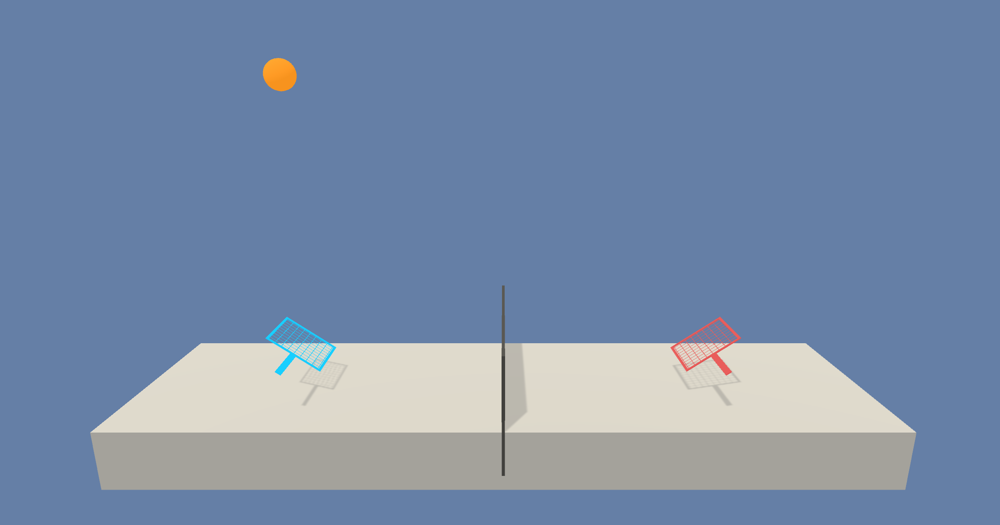
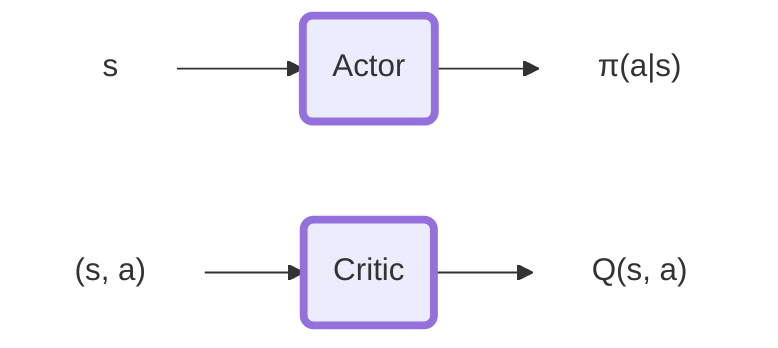
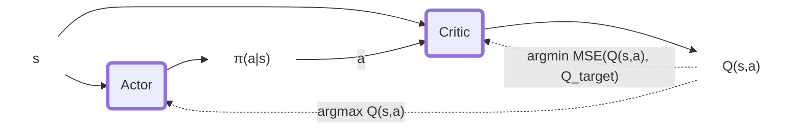
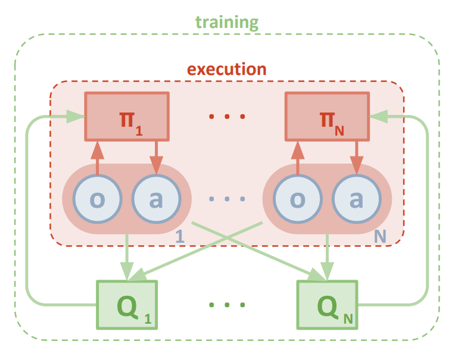
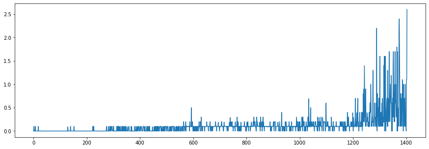
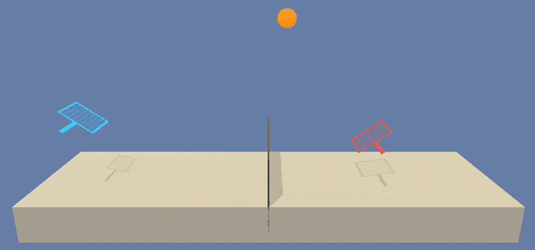

# Report Tennis

The code in this repository implements processes to train and execute autonomous agents that can cooperate in a Tennis game environment.


In this environment, two agents control rackets to bounce a ball over a net. If an agent hits the ball over the net, it receives a reward of +0.1. If an agent lets a ball hit the ground or hits the ball out of bounds, it receives a reward of -0.01. Thus, the goal of each agent is to keep the ball in play.

The observation space consists of 8 variables corresponding to the position and velocity of the ball and racket. Each agent receives its own, local observation. Two continuous actions are available, corresponding to movement toward (or away from) the net, and jumping.

The task is episodic, and in order to solve the environment, your agents must get an average score of +0.5 (over 100 consecutive episodes, after taking the maximum over both agents). Specifically,

After each episode, we add up the rewards that each agent received (without discounting), to get a score for each agent. This yields 2 (potentially different) scores. We then take the maximum of these 2 scores.
This yields a single score for each episode.
The environment is considered solved, when the average (over 100 episodes) of those scores is at least +0.5.

#### Tennis Environment


In this repository, we solve this environment using two different approaches: `DDPG` and `MA-DDPG`. The first correspond to the Vanilla Version of Deep Deterministic Policy Gradient algorithm commonly used for single agent scenarios. In this instance, the same policy is shared between the two player agents without sharing any in-game information for the opponent. In other words, One policy for 2 agents focused on their local information only.
The second approach (`MA-DDPG`) extends the training behaviour of DDPG to improve the stability in multi-agent scenarios. It does it by extening the Critic of the network to receive also information from the opponent player.

## DDPG
Deep Deterministic Policy Gradient is an off-policy actor-critic Deep RL algorithm that interconnects the input and outputs of the two networks to select better policy and better value estimation iteratively. $\varepsilon$ $\pi(a|s)$.
Specifically, The actor maps state to action ($s$ -> $\pi(a|s)$) and the critic maps state action pairs to Q returns ($(s,a)$ -> $\hat{Q}(s,a)$).

The policy is updated optimizing the two losses for Actor and Critc:
$$L_{Critic} = MSE(Q_{expected}, Q_{target})$$
$$L_{Actor} = -\hat{Q}(s, \pi(a|s))$$
where

$Q_{expected} = \hat{Q}(s, a)$ is the Q-value of next state-action.

$Q_{next} = \hat{Q}(s',\pi(a'|s'))$ is the Q-value of next state-action.

$Q_{target} = r + (\gamma \cdot Q_{next} \cdot (1-terminal))$ is the discounted Q.

The whole update procedure can be summarized in the following graph:



The policy update is not applied directly on the policy to optimize. DDPG applies the update on a local copy of the policy. The "target" policy is updated through soft-update from the "local" policy:
$$θ_{target} = τ\cdotθ_{local} + (1 - τ)\cdotθ_{target}$$

Being DDPG an off-policy algorithm we use a Buffer Replay structure to serve training samples to the algorithm. This helps to maintain more uniformity in the training samples.
Here 2 versions are implemented: `BufferReplay` and `PriorityBufferReplay`. The first samples the history uniformly the second does it using a priority value related to the amount of information provided by the sample.


### Hyper-Parameters

```python
actor_hidden_sizes = [256, 128]
critic_hidden_sizes = [256, 128]
actor_hidden_transfer_function = nn.ReLU
actor_output_transfer_function = nn.Tanh
critic_transfer_function = nn.LeakyReLU
# ---------------------------
actor_learning_rate = 1e-4
critic_learning_rate = 1e-4
tau = 0.01
gamma = 0.99
```

## MA-DDPG
MA-DDPG is an extension of the DDPG algorithm to Multi-agent problem.
Multi-Agent problems are known to have strongly non-stationary environments if you train the agents individually. On the other side of the spectrum one could train a macro agent that controls the full sets of agents in the environment. However that solution would cause an explosion of the input space for our agent and therefore making training impractical.

MA-DDPG mediates these 2 approaches using its Actor-Critic components. While the Actor remains focused on the individual agents (it is the only part used at the execution time) The critic maintains a global perspective on the state,action value estimation. Indeed it uses the states and actions of both agents to estimate the value of a configuration.




### Hyper-Parameters
The hyper-parameters used here are identical to the vanilla DDPG. This allows us to compare the learning behaviour of the 2 approaches.

```python
actor_hidden_sizes = [256, 128]
critic_hidden_sizes = [256, 128]
actor_hidden_transfer_function = nn.ReLU
actor_output_transfer_function = nn.Tanh
critic_transfer_function = nn.LeakyReLU
# ---------------------------
actor_learning_rate = 1e-4
critic_learning_rate = 1e-4
tau = 0.01
gamma = 0.99
```

### Results

Both the approaches reached convergence successfully. The MultiAgent extension provided some benefit in terms of learning stability (there was no collapse in scores mid-learning) and speed of learning (number of episodes required to reach the target).

In the experiments we set a requirements for termination that is higher than the one requested by the environment definition.
We terminate the learning phase at the momement we reach a 100 episode average score of `0.6`.

Keep in mind that, according to suggestions provided by the assignment, the score should be measured based on the cumulative max score of the 2 agents. We compute the score accordingly.

#### DDPG

DDPG reaches the training target (`0.6`) in more than 2500 (almost 3000) episodes but it would reach the `0.5` target much earlier than that. The training score collapsed after 2000 episodes and started recovering at episode 2500. This clearly has to do with the stationarity of the environment and an overconfident policy.

Overall, the agent reached the target but vwey slowly and had a collapse once positive results were reached.


#### MA-DDPG

The multi-agent extension provided several benefits on the agent learning. The `0.6` target was met in only 1400 episodes without having any collapse in the training (yet).

As can be observed, the policy learned are quite similar during execution. It reaches an equilibrium in the rackets movements on the central area of the tennis field.






### Future improvements

#### Useless Movements

I find interesting how the agent behaves when the ball is on the other side. In both cases, the racket goes close to the net to then return back in the central position when the ball comes to their side. These seem like unnecessary movements.
To fix this, one could reduce the value of a state action of a factor dependant to the magnitude of the action. This should discourage movements that don't lead to improve the actual reward.

#### Convergence to repetition

In this specific environment the two agents converge (In both cases) to a situation in which the two agents just try to pass each other the ball using always the same movements.

I think that introducing some competitivity in the reward could improve the behaviour. For example during the optimization step, the reward used to calculate values could be the difference of the rewards of the 2 agents.

#### Single net for 2 agents vs Double net for 2 agents

It would be very interesting to examine the learned behaviour in case we separate the networks for the 2 tennis agents. Furthermore, alternative configurations could be explored. For example, one could use 2 separate local networks but one single target network updated using soft update from both.

#### Try different Algorithms

It would be interesting to create a multi-agent PPO algorithm. However, I suspect it would be even more sensitive to non-stationarity than DDPG.
