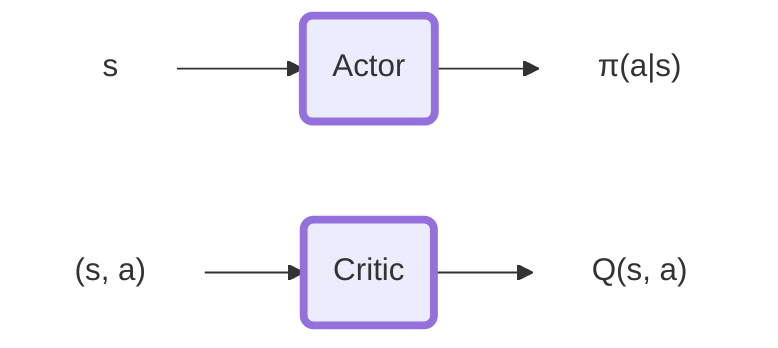
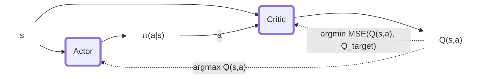
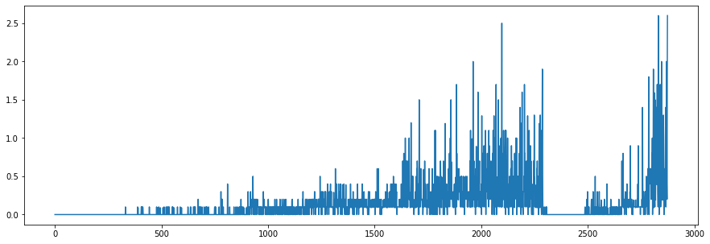
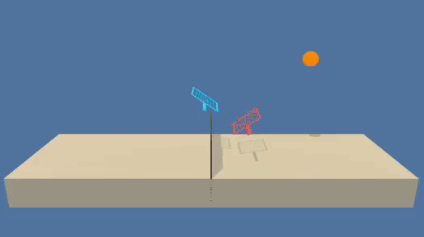

# Report Tennis


#### Tennis Environment

## DDPG
Deep Deterministic Policy Gradient is an off-policy actor-critic Deep RL algorithm that interconnects the input and outputs of the two networks to select better policy and better value estimation iteratively. $\varepsilon$ $\pi(a|s)$.
Specifically, The actor maps state to action ($s$ -> $\pi(a|s)$) and the critic maps state action pairs to Q returns ($(s,a)$ -> $\hat{Q}(s,a)$).

The policy is updated optimizing the two losses for Actor and Critc:
$$L_{Critic} = MSE(Q_{expected}, Q_{target})$$
$$L_{Actor} = -\hat{Q}(s, \pi(a|s))$$
where

$Q_{expected} = \hat{Q}(s, a)$ is the Q-value of next state-action.

$Q_{next} = \hat{Q}(s',\pi(a'|s'))$ is the Q-value of next state-action.

$Q_{target} = r + (\gamma \cdot Q_{next} \cdot (1-terminal))$ is the discounted Q.

The whole update procedure can be summarized in the following graph:



The policy update is not applied directly on the policy to optimize. DDPG applies the update on a local copy of the policy. The "target" policy is updated through soft-update from the "local" policy:
$$θ_{target} = τ\cdotθ_{local} + (1 - τ)\cdotθ_{target}$$

Being DDPG an off-policy algorithm we use a Buffer Replay structure to serve training samples to the algorithm. This helps to maintain more uniformity in the training samples.
Here 2 versions are implemented: `BufferReplay` and `PriorityBufferReplay`. The first samples the history uniformly the second does it using a priority value related to the amount of information provided by the sample.

### Hyper-Parameters
```python
actor_hidden_sizes = [256, 128]
critic_hidden_sizes = [256, 128]
actor_hidden_transfer_function = nn.ReLU
actor_output_transfer_function = nn.Tanh
critic_transfer_function = nn.LeakyReLU
# ---------------------------
actor_learning_rate = 1e-4
critic_learning_rate = 1e-4
tau = 0.01
gamma = 0.99
```


### Results






### Future improvements
